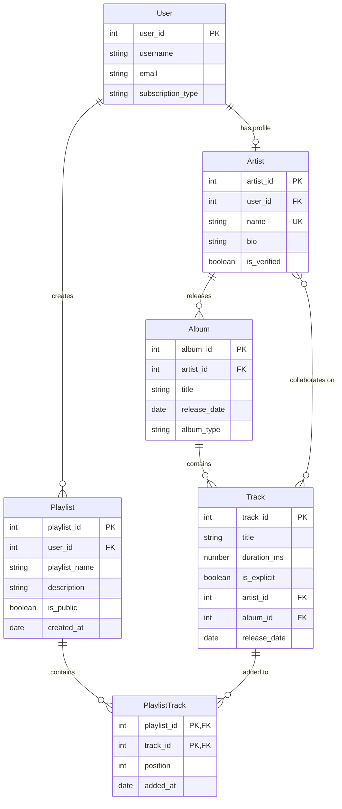

```mermaid
erDiagram

    Artist ||--o{ Album : "releases"
    User ||--o| Artist : "has profile"
    Album ||--o{ Track : "contains"
    Artist }o--o{ Track : "collaborates on"
    User ||--o{ Playlist : "creates"
    Playlist ||--o{ PlaylistTrack : "contains"
    Track ||--o{ PlaylistTrack : "added to"

    User {
        int user_id PK
        string username
        string email
        string subscription_type
    }

    Artist {
        int artist_id PK
        int user_id FK
        string name UK
        string bio
        boolean is_verified
    }

    Album {
        int album_id PK
        int artist_id FK
        string title
        date release_date
        string album_type
    }

    Track {
        int track_id PK
        string title
        number duration_ms
        boolean is_explicit
        int artist_id FK
        int album_id FK
        date release_date
    }

    Playlist {
        int playlist_id PK
        int user_id FK
        string playlist_name
        string description
        boolean is_public
        date created_at
    }

    PlaylistTrack {
        int playlist_id PK, FK
        int track_id PK, FK
        int position
        date added_at
    }
```
